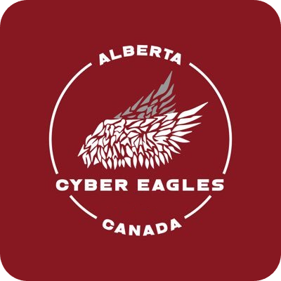

# Cyber Eagles Jade — Into the Deep (2024–2025)

<p align="center">
  
</p>

This is our FTC code for the 2024–2025 Into the Deep season. The repo has a few separate Android projects: our older Road Runner 1.0.0 build, our final version called European-comp, and our first code, Road Runner 0.5.0.

## What’s here

- Our files/
  - RR-main/ — main codebase (Road Runner 1.0.0) — archived 
- European comp/
  - IntoTheDeep-main/ — Final
- Old drive code with Roadrunner 0.5.0/
  - Season-2024-2025-main/ — archived 

Each folder is its own Android Studio project with a `gradlew.bat`, `settings.gradle`.

## Getting started (Windows)

You’ll need:
- Android Studio and Android SDK/Platform Tools
- Java 11 (Temurin/OpenJDK 11)
- USB drivers if you push over USB, or ADB

Android Studio looks for the SDK in `local.properties` via `sdk.dir=...`. If it’s missing, add it.

### Open a project
1. In Android Studio: File → Open…
2. Pick one of:
   - `Change too Roadrunner 1.0.0/RR-main`
   - `European comp/IntoTheDeep-main`
   - `Old drive code with Roadrunner 0.5.0/Season-2024-2025-main` 
3. Let Gradle sync and accept any JDK/SDK prompts.


### MeepMeep (trajectory sim)
- Open `MeepMeepTesting` and run the `main` class on desktop to see roadrunner paths.
- If configured, this also works:

```powershell
.\gradlew.bat :MeepMeepTesting:run
```

## Road Runner versions
- RR-main: Road Runner 1.0.0
- Season-2024-2025-main: Road Runner 0.5.0 (reference)

If you move code between them, watch for drive constraint changes, trajectory builder call changes, and localization API changes.

## Modules you’ll see (per project)
- FtcRobotController — app + SDK resources
- TeamCode — our TeleOp/Auto and subsystems
- MeepMeepTesting — desktop-only RR paths
- libs — keystores and third‑party jars
- gradle — wrapper and build tooling


## License
See `LICENSE`.
